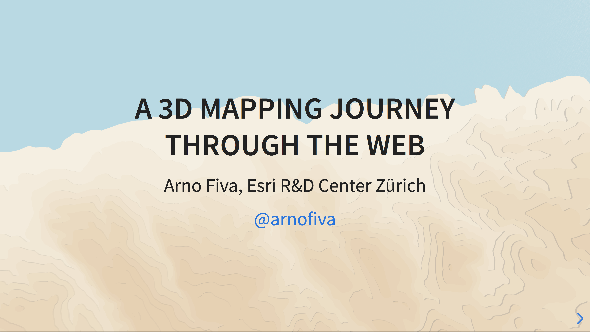

# A 3D Mapping Journey through the Web

Presentation for my talk at Front Conference in Zurich 29.08.2019.

Online version available [here](https://arnofiva.github.io/2019-08-front-conference-talk/).

Recordings of the talk can be found on [Vimeo](https://vimeo.com/356660578).



## Usage

The presentation is built using [reveal-md](https://github.com/webpro/reveal-md). Follow these steps to run it locally:

```
npm install
npm run start
```

This will launch the default browser and serve the presentation at http://localhost:1948/main.md