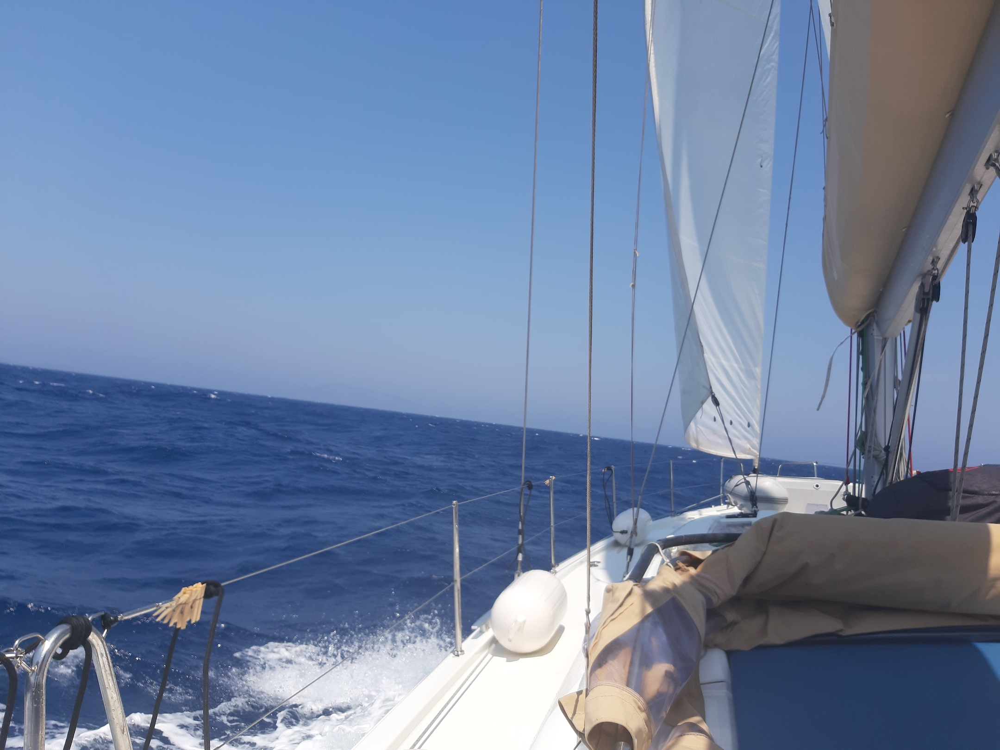
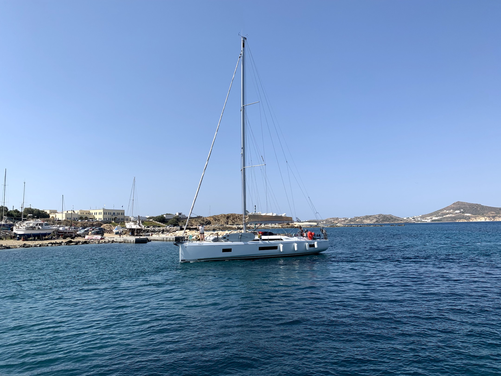

<!-- .slide: data-background="images/background.png"  data-background-size="cover" -->


## A 3D Mapping Journey through the Web

Arno Fiva, Esri R&D Center Zürich

[@arnofiva](https://twitter.com/arnofiva)

Note: Intro

---

<!-- .slide: data-background="images/js-api-sdk.png" data-background-color="#000000" data-background-size="contain" -->


ArcGIS API for JavaScript
<a href="https://developers.arcgis.com/javascript/" target="_blank">
https://developers.arcgis.com/javascript/</a>

<!-- .element: class="overlay" style="top: 500px;" -->

Note: Share 3D maps in web

---

<!-- .slide: data-background="images/scene-viewer.png" data-background-color="#000000" data-background-size="contain" -->

ArcGIS Online Scene Viewer
<a href="https://www.arcgis.com/home/webscene/viewer.html" target="_blank">
https://www.arcgis.com/home/webscene/viewer.html</a>

<!-- .element: class="overlay" style="top: 500px;" -->

---

<!-- .slide: data-background-color="#000000" -->

 <!-- .element style="max-width: 80%;" -->


Note: Sailing trips

---

<!-- .slide: data-background="images/sailing-map.png" data-background-color="#000000" data-background-size="contain" -->

```javascript
var map = new Map({
  basemap: "satellite"
});

var view = new MapView({
  container: "viewDiv",
  map: map,
});
```
<!-- .element: class="fragment map-css" -->

---

<!-- .slide: data-background-video="mp4/2d-cyclades.mp4" data-background-color="#000000" data-background-size="contain" -->

```javascript
view.goTo({
  center: [
    25.42585, // longitude
    37.00871, // latitude
  ],
  zoom: 10
});
```
<!-- .element: class="fragment map-css" -->

Note: Let's create a map for the route

---

<!-- .slide: data-background="images/2d-cyclades-path.png" data-background-color="#000000" data-background-size="contain" -->

```javascript
view.graphics.add({
  geometry: {
    type: "polyline",
    paths: [
      [25.42585, 37.00871],
      [25.67100, 36.90075],
      ...
    ],
  },
  symbol: {
    type: "simple-line",
    color: "darkorange",
  }
});
```
<!-- .element: class="fragment map-css" -->

Note: Tools, apps, or - create one programmatically

---

<!-- .slide: data-background="images/2d-cyclades-points.png" data-background-color="#000000" data-background-size="contain" -->

Note: Finished map

---

<!-- .slide: data-background="images/2d-cyclades-points.png" data-background-color="#000000" data-background-size="contain" -->



<!-- .element: style="max-width: 40%; position: absolute; top: -50px; left: -100px;" -->


<!-- .element: style="max-width: 40%; position: absolute; top: -30px; left: 450px;" -->


<!-- .element: style="max-width: 40%; position: absolute; top: 300px; right: -150px;" -->

Note:


---


**Polarsteps - Automatic Travel Tracking** \
<a href="https://www.polarsteps.com/" target="_blank">
https://www.polarsteps.com/</a>

<!-- .element: class="overlay" style="top: 400px;" -->

---

<!-- .slide: data-background="images/2d-cyclades-points.png" data-background-color="#000000" data-background-size="contain" -->

```javascript
var map = new Map({
  basemap: "satellite",
  ground: "world-elevation",
});

/* var view = new MapView({ */
var view = new SceneView({
  container: "viewDiv",
  map: map,
});
```

<!-- .element: class="fragment map-css" -->

---

<!-- .slide: data-background-video="mp4/3d-cyclades.mp4" data-background-color="#000000" data-background-size="contain" -->

Note: First we'll add 3d, because that's what we do -> show code

---

<!-- .slide: data-background-video="mp4/3d-cyclades-zoom-in.mp4" data-background-color="#000000" data-background-size="contain" -->


```javascript
view.goTo({
  position: {
    longitude: 25.67100,
    latitude: 36.90075,
    z: 560,
  },
  heading: 45, // degree
  tilt: 41, // degree
});
```

<!-- .element: class="fragment map-css" -->

Note: Satellite imaginary gives us very detailed view of the area

---

<!-- .slide: data-background-video="mp4/3d-cyclades-zoom-out.mp4" data-background-color="#000000" data-background-size="contain" -->

Note: But sometimes it makes sense to apply schematic views also in 3D

---

<!-- .slide: data-background-video="mp4/3d-cyclades-topo.mp4" data-background-color="#000000" data-background-size="contain" -->

```

map.basemap = "topo-vector";


```

<!-- .element: class="fragment map-css" -->

Note: Editors exist to change the colors of all features

---


**Contour lines** \
<a href="https://contours.axismaps.com" target="_blank">
https://contours.axismaps.com</a>

<!-- .element: class="overlay" style="top: 400px;" -->

---

<!-- .slide: data-background="images/cyclades-topo.png" data-background-color="#000000" data-background-size="contain" -->

```javascript
map.add(new GeoJSONLayer({
  url: "./contours.geojson",
  elevationInfo: {
    mode: "absolute-height",
    offset: "0"
  },
  renderer: {
    type: "extrude",
    material: {
      color: shoreColor
    },
    size: 50,
    ...
  }
}));
```

<!-- .element: class="fragment" -->

---

<!-- .slide: data-background-video="mp4/3d-cyclades-contours.mp4" data-background-color="#000000" data-background-size="contain" -->

Note: Draw contour lines as extruded polygons

---

<!-- .slide: data-background-video="mp4/3d-cyclades-goto.mp4" data-background-color="#000000" data-background-size="contain" -->

Note: Use the same camera animations

---

<!-- .slide: data-background-video="mp4/3d-cyclades-animated-path.mp4" data-background-color="#000000" data-background-size="contain" -->

Note: With a little more math interpolate the lines


---

<!-- .slide: data-background="images/cyclades-contours.png" data-background-color="#000000" data-background-size="contain" -->


<!-- .element: style="max-width: 40%; position: absolute; top: -50px; left: -100px;" -->


<!-- .element: style="max-width: 40%; position: absolute; top: -30px; left: 450px;" -->


<!-- .element: style="max-width: 40%; position: absolute; top: 300px; right: -150px;" -->


Note: Pages like AirBnB do an amazing job in maintining usability between content and map

---

<!-- .slide: data-background-video="mp4/scrollytelling-path.mp4" data-background-color="#000000" data-background-size="contain" -->

Note: Scrollytelling, no animations, all hooked up to scroll progress. Missing navigation, does not react to input events.

---

<!-- .slide: data-background-video="mp4/scrollytelling-fade-out.mp4" data-background-color="#000000" data-background-size="contain" -->

Note: Allows you to iterate between different content types, embed map as if it was a piece of media, like an image.

---

```javascript
/* JavaScript */
window.onscroll = function (e) {
  var r = domElement.getBoundingClientRect();
  var top = window.innerHeight - r.top;
  var seek = Math.min(r.height, Math.max(0, top)) / r.height;

  // Use seek [0.0, 1.0] to fade, move, interpolate
}
```

```css
/* CSS: Sticky elements */
content {
  position: sticky;
  top: 100px;
}
```
<!-- .element: class="fragment" -->

```css
/* CSS: Disable interactions on map */
#viewDiv {
  pointer-events: none;
}
```
<!-- .element: class="fragment" -->

Note: Scrolling ingredients, sticky, disable input events

---

<!-- .slide: data-background-video="mp4/scrollytelling-camera.mp4" data-background-color="#000000" data-background-size="contain" -->

Note: also hook up Camera to scroll progress

---

<!-- .slide: data-background-video="mp4/scrollytelling-elevation.mp4" data-background-color="#000000" data-background-size="contain" -->

Note: API draws path on top of invisible elevation layer. Map no longer distracts but supports content. User does not get lost in map, either because of UI struggles or curiosity -> you can still allow user to explore map at any point in time. Guide user along a linear path through your content and make sure they reach the end.

---

## WebGL

---

<!-- .slide: data-background="images/caniuse-webgl.png" data-background-color="#000000" data-background-size="contain" -->

---

## 3D WebGL Frameworks

 <!-- .element class="logo logo-babylonjs" -->
 <!-- .element class="logo logo-threejs" -->

 <!-- .element class="logo logo-cesium" -->
 <!-- .element class="logo logo-deckgl" -->

 <!-- .element class="logo logo-here" -->
 <!-- .element class="logo logo-mapbox" -->

 <!-- .element class="logo logo-esri" -->

* Visualization
* Data Streaming
* Elevation
* Client-side analysis
* Search / Geocoding / Routing

<!-- .element: class="overlay" -->

Note: each framework specialized on different aspects, ArcGIS JS API allows integrating other data sources

---

## Urban Visualizations

Note: Would be nice if we could create sailing maps all day, but 3D visualization is probably used more often for Urban visualizations

---

<!-- .slide: data-background-video="mp4/ny-mesh.mp4" data-background-video-loop="true" data-background-color="#000000" data-background-size="contain" -->

**Aerial map by Nearmap US Inc.** \
https://www.nearmap.com/

<!-- .element: class="fragment overlay" style="top: 500px;" -->

Note: Different level of detail

---

<!-- .slide: data-background-video="mp4/sf-overview.mp4" data-background-color="#000000" data-background-size="contain" -->

Note: Large number of 3D objects

---

<!-- .slide: data-background-video="mp4/sf-traffic-viz.mp4" data-background-color="#000000" data-background-size="contain" -->


<!-- .element style="max-width: 25%; position: absolute; top: 250px; right: 0px;" -->

Note: We can also use it to visualize data => Legend!

---

<!-- .slide: data-background-video="mp4/sf-camera.mp4" data-background-color="#000000" data-background-size="contain" -->

---

<!-- .slide: data-background-video="mp4/sf-sketch-load.mp4" data-background-color="#000000" data-background-size="contain" -->

Note: Not only realistic

---

<!-- .slide: data-background-video="mp4/sf-sketch-pan-1.mp4" data-background-color="#000000" data-background-size="contain" -->

Note: Don't be fooled by what looks like a drawing

---

<!-- .slide: data-background-video="mp4/sf-sketch-pan-2.mp4" data-background-color="#000000" data-background-size="contain" -->

**Sketch the city by Raluca Nicola** \
<a href="https://github.com/RalucaNicola/JSAPI_demos" target="_blank">
https://github.com/RalucaNicola/JSAPI_demos</a>

<!-- .element: class="fragment overlay" style="top: 500px;"  -->

Note: Can be useful for a map showing historic information about a city

---

<!-- .slide: data-background-video="mp4/sf-sketch-filter.mp4" data-background-color="#000000" data-background-size="contain" -->

```
// Apply sketched edges with JS
buildingSymbolLayer = {
  type: "fill",
  material: {
    color: [255, 255, 255, 0.1],
    colorMixMode: "replace"
  },
  edges: {
    type: "sketch",
    color: [0, 0, 0, 0.8],
    size: 1,
    extensionLength: 2
  }
};
```
<!-- .element: class="fragment city-sf-css" -->

Note: Let's look at some of the details -> sketch edges

---

<!-- .slide: data-background-video="mp4/sf-sketch-chalk.mp4" data-background-color="#000000" data-background-size="contain" -->

```
// Apply sketched edges with JS
buildingSymbolLayer = {
  type: "fill",
  material: {
    color: [10, 10, 10, 0.1],
    colorMixMode: "replace"
  },
  edges: {
    type: "sketch",
    color: [255, 255, 255, 0.8],
    size: 2,
    extensionLength: 2
  }
};
```
<!-- .element: class="city-sf-css" -->

Note: But we can also change the colors to something that looks like a chalk board

---

<!-- .slide: data-background-video="mp4/sf-sketch-neon.mp4" data-background-color="#000000" data-background-size="contain" -->

```
/* Combine CSS with WebGL canvas */
#viewDiv {
  filter: drop-shadow(
    0 0 5px rgb(255, 0, 255)
  );
}
```

<!-- .element: class="city-sf-css" -->

Note: CSS has an effect on the Canvas! Add neon effect to house

---

<!-- .slide: data-background-video="mp4/city-ny-explorer.mp4" data-background-color="#000000" data-background-size="contain" -->

Note:

---

<!-- .slide: data-background-video="mp4/city-ny-github.mp4" data-background-color="#000000" data-background-size="contain" -->

**Source Code & Demo**
<a href="https://github.com/esri/Manhattan-skyscraper-explorer/" target="_blank">
https://github.com/esri/Manhattan-skyscraper-explorer/</a>

<!-- .element: class="overlay" -->

Note:

---

<!-- .slide: data-background-video="mp4/zh-buildings.mp4" data-background-transition="fade" data-background-color="#000000" data-background-size="contain" -->

**Hochhaus-Viewer** \
<a href="https://hochhaeuser.stadt-zuerich.ch/" target="_blank">
https://hochhaeuser.stadt-zuerich.ch/</a>

<!-- .element: class="overlay" -->

Note:

---

<!-- .slide: data-background-video="mp4/zh-buildings-future.mp4" data-background-color="#000000" data-background-size="contain" -->

**Hochhaus-Viewer** \
<a href="https://hochhaeuser.stadt-zuerich.ch/" target="_blank">
https://hochhaeuser.stadt-zuerich.ch/</a>

<!-- .element: class="overlay" -->

Note:

---

<!-- .slide: data-background-video="mp4/zh-buildings-perspective.mp4" data-background-color="#000000" data-background-size="contain" -->

**Hochhaus-Viewer** \
<a href="https://hochhaeuser.stadt-zuerich.ch/" target="_blank">
https://hochhaeuser.stadt-zuerich.ch/</a>

<!-- .element: class="overlay" -->

Note:


---

## 3D User Input

Note:

---

<!-- .slide: data-background-video="mp4/draw-polygon.mp4" data-background-color="#000000" data-background-size="contain" -->

Note:

---

<!-- .slide: data-background-video="mp4/draw-symbol.mp4" data-background-color="#000000" data-background-size="contain" -->

Note:

---

<!-- .slide: data-background-video="mp4/draw-pp-intro.mp4" -->

**Participatory Planning** \
<a href="https://github.com/Esri/participatory-planning" target="_blank">
https://github.com/Esri/participatory-planning</a>

<!-- .element: class="overlay" -->

Note:

---

<!-- .slide: data-background-video="mp4/draw-participatory-planning.mp4"  -->

**Participatory Planning** \
<a href="https://github.com/Esri/participatory-planning" target="_blank">
https://github.com/Esri/participatory-planning</a>

<!-- .element: class="overlay" -->

Note:

---

## Thank you

For more information:

https://developers.arcgis.com/javascript/

https://github.com/arnofiva

[@arnofiva](https://twitter.com/arnofiva)